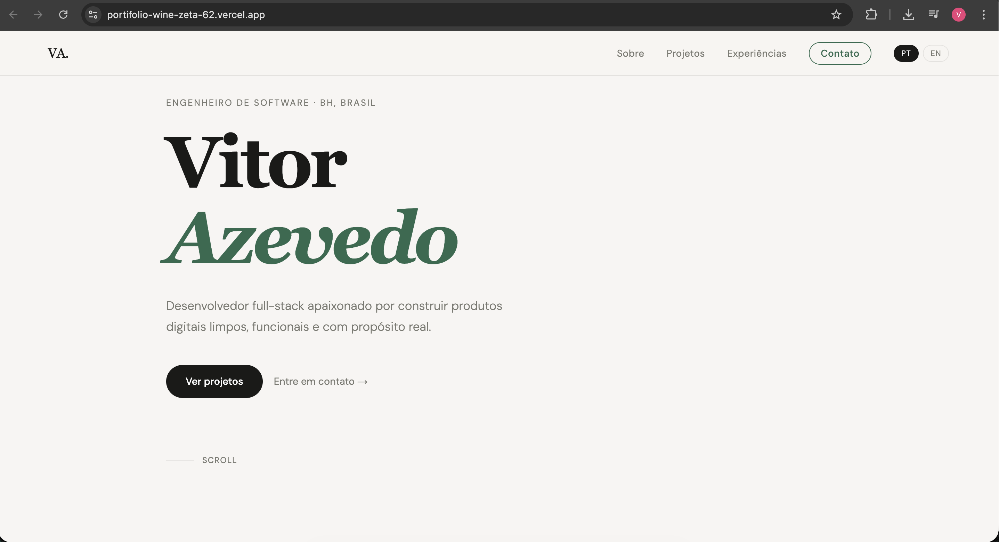
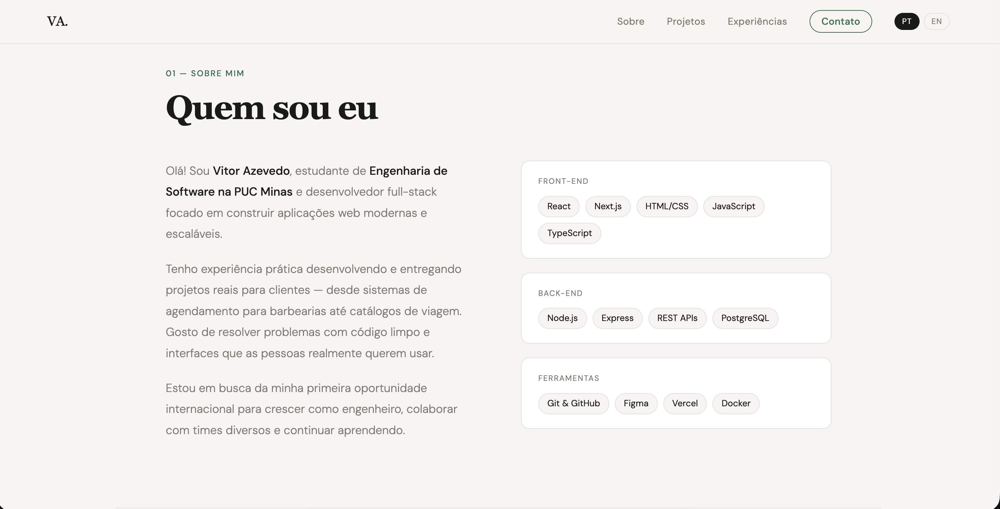
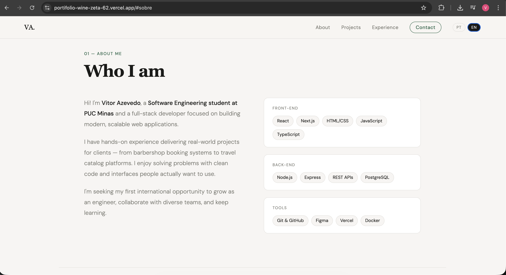
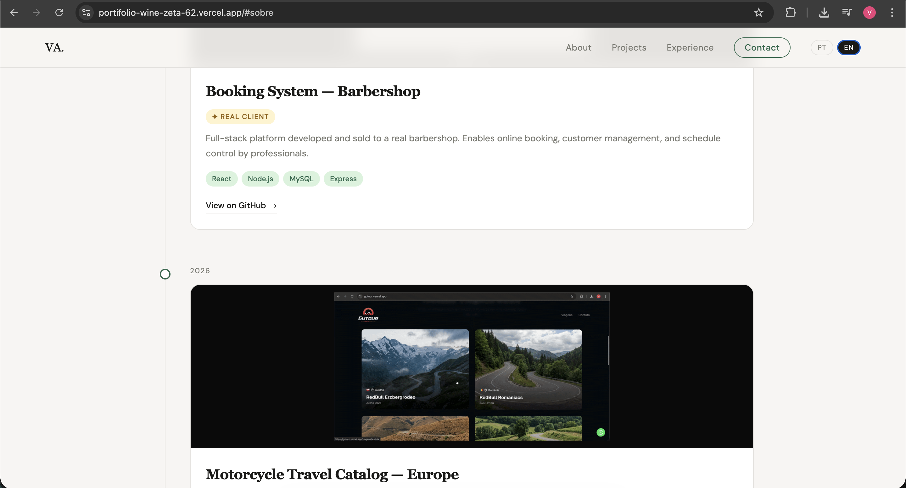
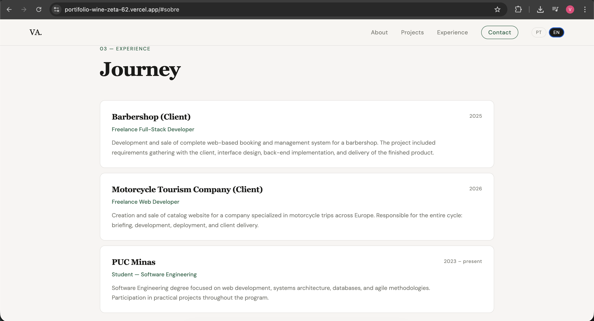
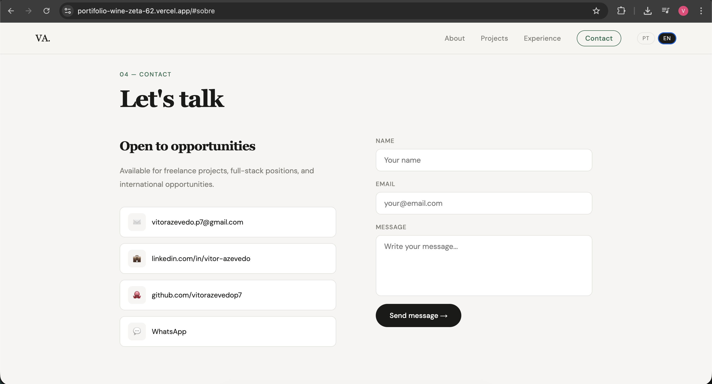
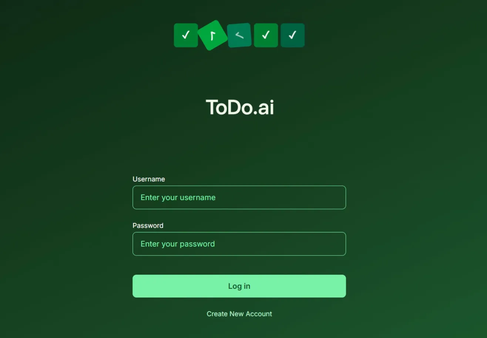
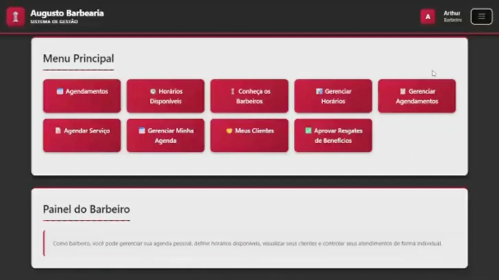

# 💼 Vitor Azevedo — Portfólio Profissional 👨‍💻

> Website de portfólio profissional para apresentar trajetória, habilidades, projetos reais e formas de contato de maneira moderna e acessível.

<table>
  <tr>
    <td width="800px">
      <div align="justify">
        Este portfólio foi desenvolvido como projeto da disciplina de <b>Engenharia de Software</b> da <b>PUC Minas</b> (Lab01 — Sprints 01, 02 e 03). O objetivo é criar uma vitrine profissional completa e hospedada na nuvem, reunindo trajetória acadêmica, projetos entregues a clientes reais, experiências e canais de contato em um único site moderno e responsivo. O sistema conta com apresentação <b>bilíngue (PT/EN)</b>, timeline de projetos com galeria de imagens, formulário de contato funcional via API e deploy contínuo na Vercel.
      </div>
    </td>
    <td>
      <div align="center">
        
      </div>
    </td>
  </tr>
</table>

---

## 🚧 Status do Projeto


---

## 📚 Índice

- [🔗 Links Úteis](#-links-úteis)
- [📝 Sobre o Projeto](#-sobre-o-projeto)
- [✨ Funcionalidades Principais](#-funcionalidades-principais)
- [🛠 Tecnologias Utilizadas](#-tecnologias-utilizadas)
- [🏗 Arquitetura](#-arquitetura)
- [🔧 Instalação e Execução](#-instalação-e-execução)
- [🚀 Deploy](#-deploy)
- [📂 Estrutura de Pastas](#-estrutura-de-pastas)
- [🎥 Demonstração](#-demonstração)
- [🔗 Documentações Utilizadas](#-documentações-utilizadas)
- [👥 Autores](#-autores)
- [🙏 Agradecimentos](#-agradecimentos)
- [📄 Licença](#-licença)

---

## 🔗 Links Úteis

* 🌐 **Demo Online:** [portifolio-wine-zeta-62.vercel.app](https://portifolio-wine-zeta-62.vercel.app)
* :octocat: **Repositório:** [github.com/vitorazevedop7/portifolio](https://github.com/vitorazevedop7/portifolio)

---

## 📝 Sobre o Projeto

Este projeto foi desenvolvido como parte da disciplina de **Engenharia de Software** da **PUC Minas** (Lab01 — Sprints 01, 02 e 03), com o objetivo de criar um portfólio profissional completo e hospedado na nuvem.

**Por que ele existe?** Em um mercado competitivo — especialmente para quem busca oportunidades internacionais —, ter um portfólio online bem estruturado é essencial para demonstrar competência técnica além do currículo.

**Qual problema resolve?** Centraliza em um único lugar a apresentação profissional, os projetos desenvolvidos, as experiências acumuladas e os canais de contato, tornando o processo de recrutamento mais eficiente para ambas as partes.

**Contexto:** Projeto acadêmico com aplicação real — o site é efetivamente utilizado como portfólio profissional, incluindo dois projetos entregues a clientes reais (sistema de barbearia e catálogo de viagens de moto).

**Valor entregue:** Qualquer recrutador ou cliente pode, em menos de dois minutos, entender quem é o desenvolvedor, o que ele já construiu e como entrar em contato.

> **Nota:** Este README segue as boas práticas de documentação recomendadas pelo [Prof. Dr. João Paulo Aramuni](https://github.com/joaopauloaramuni).

---

## ✨ Funcionalidades Principais

- 🌐 **Bilíngue (PT/EN):** Toggle entre português e inglês em toda a navegação, ampliando o alcance internacional.
- 📋 **Timeline de Projetos:** Projetos organizados cronologicamente com galeria de imagens/GIFs navegável (setas + dots), descrição, tecnologias e links.
- 🏷️ **Badge "Cliente real":** Destaque visual para projetos entregues e vendidos a clientes reais.
- 💼 **Seção de Experiências:** Experiências profissionais freelancer com empresa, cargo, período e descrição.
- 📬 **Formulário de Contato Funcional:** Envio de mensagens por e-mail via [Resend](https://resend.com/) com validação de campos e feedback visual.
- 🔗 **Links Sociais Clicáveis:** Acesso direto a e-mail, LinkedIn, GitHub e WhatsApp.
- 📱 **Design Responsivo:** Layout adaptado para desktop, tablet e mobile.
- ⚡ **Deploy Contínuo:** Cada push na branch `main` gera um novo deploy automático na Vercel.

---

## 🛠 Tecnologias Utilizadas

### 💻 Front-end

| Tecnologia | Versão | Uso |
|---|---|---|
| [Next.js](https://nextjs.org/) | 14.2.3 | Framework React com App Router |
| [React](https://react.dev/) | 18.x | Biblioteca de interface |
| [TypeScript](https://www.typescriptlang.org/) | 5.x | Tipagem estática |
| [Google Fonts](https://fonts.google.com/) | — | Fontes DM Serif Display + DM Sans |

### 🖥️ Back-end

| Tecnologia | Versão | Uso |
|---|---|---|
| [Next.js API Routes](https://nextjs.org/docs/app/building-your-application/routing/route-handlers) | 14.2.3 | Route Handler para envio de e-mail (`/api/contact`) |
| [Resend](https://resend.com/) | 3.2.0 | SDK de envio de e-mail transacional |

### ⚙️ Infraestrutura & DevOps

| Tecnologia | Uso |
|---|---|
| [Vercel](https://vercel.com/) | Hospedagem e deploy contínuo (gratuito) |
| [Git + GitHub](https://github.com/) | Versionamento e repositório |

### 📦 Dependências completas

```json
{
  "dependencies": {
    "next": "14.2.3",
    "react": "^18",
    "react-dom": "^18",
    "resend": "^3.2.0"
  },
  "devDependencies": {
    "typescript": "^5",
    "@types/node": "^20",
    "@types/react": "^18",
    "@types/react-dom": "^18",
    "eslint": "^8",
    "eslint-config-next": "14.2.3"
  }
}
```

---

## 🏗 Arquitetura

O projeto adota a arquitetura **JAMstack** (JavaScript, APIs, Markup), utilizando o Next.js com **App Router**. O conteúdo é servido via CDN pela Vercel, com uma única API Route server-side para o envio de e-mail.

**Principais decisões arquiteturais:**

- **Single Page Application com scroll suave:** Todas as seções (Sobre, Projetos, Experiências, Contato) estão na mesma página, acessadas por âncoras via menu de navegação fixo.
- **API Route server-side para e-mail:** O formulário usa uma Route Handler (`/api/contact`) que chama o Resend no servidor, mantendo a chave secreta protegida no back-end.
- **Componentização:** Cada seção é um componente React independente (`<Hero />`, `<Sobre />`, `<Projetos />`, etc.).
- **Contexto de idioma:** Um `LanguageContext` global gerencia o toggle PT/EN sem dependência de bibliotecas externas de i18n.
- **Dados estáticos:** Projetos e experiências são armazenados em arquivos `.ts` em `/src/data`, separando conteúdo de apresentação.

**Fluxo de dados:**

```
Usuário → Vercel CDN → Next.js App Router
                              ↓
                    Componentes React (Client-side)
                              ↓
               Formulário → /api/contact (Server) → Resend API → E-mail
```

### Diagramas

| Arquitetura Geral | Fluxo do Formulário de Contato |
|:---:|:---:|
| **JAMstack + Next.js App Router** | **Formulário → Resend → E-mail** |
| *(adicionar diagrama)* | *(adicionar diagrama de sequência)* |

---

## 🔧 Instalação e Execução

### Pré-requisitos

* **Node.js:** v18.x ou superior
* **npm:** v9.x ou superior
* Conta no [Resend](https://resend.com/) para ativar o formulário de contato

### 🔑 Variáveis de Ambiente

Crie o arquivo `.env.local` na raiz do projeto:

```bash
cp .env.example .env.local
```

Preencha com suas credenciais:

| Variável | Descrição | Exemplo |
|---|---|---|
| `RESEND_API_KEY` | Chave de API do Resend | `re_xxxxxxxxxxxxxxxx` |
| `RESEND_TO_EMAIL` | E-mail que receberá as mensagens | `seu@email.com` |

Exemplo do `.env.local`:

```env
RESEND_API_KEY=re_xxxxxxxxxxxxxxxx
RESEND_TO_EMAIL=seu@email.com
```

> **Obs:** No plano gratuito do Resend, `RESEND_TO_EMAIL` deve ser o mesmo e-mail cadastrado na conta Resend. As variáveis sem prefixo `NEXT_PUBLIC_` ficam exclusivamente no servidor — nunca expostas ao cliente.

### 📦 Instalação de Dependências

```bash
# 1. Clone o repositório
git clone https://github.com/vitorazevedop7/portifolio.git
cd portifolio

# 2. Instale as dependências
npm install
```

### ⚡ Como Executar a Aplicação

**Modo desenvolvimento:**

```bash
npm run dev
# Acesse em: http://localhost:3000
```

**Build de produção:**

```bash
# Gera os arquivos otimizados
npm run build

# Visualiza o build localmente
npm start
```

---

## 🚀 Deploy

O projeto está hospedado na **Vercel** com deploy contínuo a partir da branch `main`.

🔗 **[https://portifolio-wine-zeta-62.vercel.app](https://portifolio-wine-zeta-62.vercel.app)**

**Para replicar o deploy:**

1. Faça push do projeto para o GitHub
2. Acesse [vercel.com](https://vercel.com) e conecte sua conta GitHub
3. Importe o repositório `portifolio`
4. Adicione as variáveis de ambiente em **Project Settings > Environment Variables**:

| Variável | Descrição |
|---|---|
| `RESEND_API_KEY` | Chave de API do Resend |
| `RESEND_TO_EMAIL` | E-mail destinatário das mensagens |

5. Clique em **Deploy** — a Vercel detecta Next.js automaticamente

Cada novo `git push origin main` dispara um redeploy automático.

---

## 📂 Estrutura de Pastas

```
portifolio/
├── public/
│   ├── imgs/
│   │   ├── barbearia/                      # 🖼️ Screenshots do sistema de agendamento
│   │   │   ├── barbearia-dashboard.webp
│   │   │   ├── barbearia-agendamento.webp
│   │   │   └── barbearia-gerenciar_horarios.webp
│   │   ├── gutour/                          # 🎥 GIF do catálogo de viagens de moto
│   │   │   └── gutour-tela.gif
│   │   └── todo/                            # 🖼️ Screenshots do To-Do App
│   │       ├── todo-login.webp
│   │       ├── todo-tasks.webp
│   │       ├── todo-new-task.webp
│   │       └── todo-edit-task.webp
│   └── imgs-prototipos/                     # 🎨 Wireframes do Figma (Sprint 01)
├── src/
│   ├── app/
│   │   ├── api/contact/
│   │   │   └── route.ts                    # 📧 API Route de envio de e-mail (Resend)
│   │   ├── globals.css                     # 🎨 Estilos globais
│   │   ├── layout.tsx                      # 🧱 Layout global
│   │   └── page.tsx                        # 📄 Página principal
│   ├── components/
│   │   ├── ClientProviders.tsx             # 🔧 Providers client-side
│   │   ├── Contato.tsx                     # 📬 Formulário de contato
│   │   ├── Experiencias.tsx                # 💼 Timeline de experiências
│   │   ├── Footer.tsx                      # 📋 Rodapé
│   │   ├── Hero.tsx                        # 🏠 Seção principal
│   │   ├── Nav.tsx                         # 🔝 Navegação com toggle PT/EN
│   │   ├── Projetos.tsx                    # 💻 Timeline de projetos com galeria
│   │   └── Sobre.tsx                       # 👤 Apresentação em PT e EN
│   ├── contexts/
│   │   └── LanguageContext.tsx             # 🌐 Contexto de idioma (PT/EN)
│   ├── data/
│   │   ├── experiences.ts                  # 📊 Dados das experiências
│   │   └── projects.ts                     # 📊 Dados dos projetos
│   └── types/
│       └── index.ts                        # 🔷 Tipagens TypeScript globais
├── .env.example                            # 🧩 Exemplo de variáveis (sem valores sensíveis)
├── .env.local                              # 🔒 Variáveis locais SENSÍVEIS (não versionado)
├── .gitignore
├── next.config.js
├── package.json
└── tsconfig.json
```

---

## 🎥 Demonstração

### 🌐 Protótipos — Sprint 01

| | | |
|---|---|---|
|  |  |  |
|  |  |  |
|  | | |

### 🖥️ Site Final — Sprint 03


| Tela | Captura de Tela |
|:---:|:---:|
| **Hero / Home** | **Sobre Mim — PT** |
|  |  |
| **Sobre Mim — EN** | **Timeline de Projetos** |
|  |  |
| **Experiências** | **Formulário de Contato** |
|  |  |

### 📁 Projetos em Execução — Sprint 03

| Projeto | Telas |
|:---:|:---:|
| **To-Do App Full-Stack** | **Sistema de Agendamento — Barbearia** |
|  |  |
| **Gutour — Viagens de Moto pela Europa** | |
|  | |

---

## 🔗 Documentações Utilizadas

* 📖 [Documentação Oficial do Next.js](https://nextjs.org/docs)
* 📖 [Documentação do React](https://react.dev/)
* 📖 [Resend — Docs & API Reference](https://resend.com/docs)
* 📖 [Vercel — Deploy Next.js](https://vercel.com/docs/frameworks/nextjs)
* 📖 [Conventional Commits](https://www.conventionalcommits.org/pt-br/v1.0.0/) — Padrão de mensagens de commit

---

## 👥 Autores

| 👤 Nome | 🖼️ Foto | :octocat: GitHub | 💼 LinkedIn | 📤 Gmail |
|:---:|:---:|:---:|:---:|:---:|
| Vitor Augusto Viana Azevedo | <div align="center"></div> | <div align="center"><a href="https://github.com/vitorazevedop7"></a></div> | <div align="center"><a href="https://www.linkedin.com/in/vitor-azevedo-293609343/"></a></div> | <div align="center"><a href="mailto:vitorazevedo.p7@gmail.com"></a></div> |

---

## 🙏 Agradecimentos

* [**Engenharia de Software PUC Minas**](https://www.instagram.com/engsoftwarepucminas/) — Pelo apoio institucional, estrutura acadêmica e fomento à inovação e boas práticas de engenharia.
* [**Prof. Dr. João Paulo Aramuni**](https://github.com/joaopauloaramuni) — Pelos valiosos ensinamentos sobre **Engenharia de Software**, boas práticas de documentação e arquitetura de sistemas.
* [**Vercel**](https://vercel.com/) — Pela plataforma de hospedagem gratuita com suporte nativo ao Next.js.
* [**Resend**](https://resend.com/) — Pelo serviço de envio de e-mail com API simples e plano gratuito generoso.

---

## 📄 Licença

Este projeto está distribuído sob a **Licença MIT**. Veja o arquivo [LICENSE](./LICENSE) para mais detalhes.

---

*Engenharia de Software — PUC Minas · Lab01S03 · 2026*
